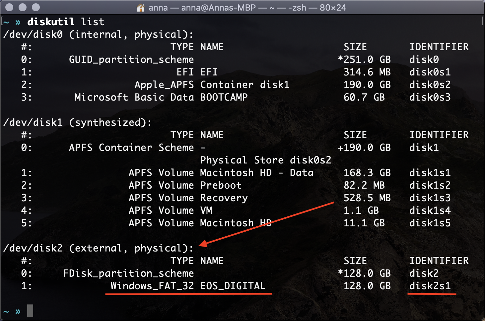
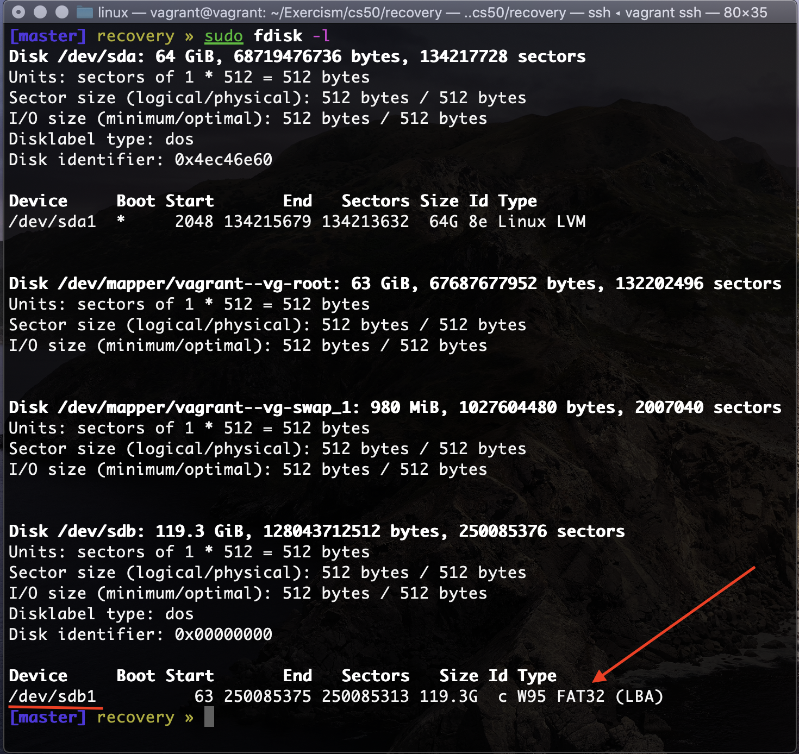

# undelete_jpg
undelete_jpg is a program that recovers JPG images from SD cards and hard drives.

## Introduction
When deleting an image from an SD card, only the directory entry to the file is removed but the content still remains on the device.
undelete_jpg recognizes that undeleted content and recovers JPG files. The recovered files may be corrupted because cameras
write new files into deallocated device space, but undelete_jpg will try its best to output only valid JPG files.

## Implementation
A JPG file is comprised of a list of JPG markers such as SOI (start of image), SOS (start of scan),
EOI (end of image), etc. More about JPG markers [here](https://en.wikipedia.org/wiki/JPEG#Syntax_and_structure).
When possible, undelete_jpg uses mmap() to map the device content into memory, othererwise it uses read().
When reading through the content of the device, undelete_jpg uses memchr(), which is typically optimized with SIMD instructions, to detect SOI markers.
If it can it will use mmap, otherwise it will use read()

undelete_jpg is fast: on a Macbook Pro with a 2.8 GHz Quad-Core Intel Core i7, undelete_jpg goes through a cached file at **10 GB/s**.
**This is actually the memory bandwidth on this machine**.
The throughput is well over the read speed of typical SD cards (10MB/s up to 500 MB/s).

## Usage
Run the following in your terminal:
```
git clone https://github.com/saintmarina/undelete_jpg.git
cd undelete_jpg
make
sudo ./undelete_jpg /dev/block_device
```

Notes:
* `sudo` is required for block device access.
* Recovered JPG files are written in the current directory.
* Ways to get device path is platform dependent. Follow section below for more detailed instructions.


### How to get device path on macOS
To list all mounted drives and it's partitions on a macOS, run the following:
```
diskutil list
```
Find your device's path in the list.
As an example, see what the list looks like on my machine.



From the example above the path looks like this:
```
sudo ./undelete_jpg /dev/rdisk2s1
```
Add `r` in the beginning of your device path. `r` stands for raw.

### How to get device path on Linux
To list devices and their partitions on linux, run:
```
sudo fdisk -l
```
Find your device in the partition table.

As an example, see what the partition table looks like on my machine.



Example of running the program on linux:
```
sudo ./undelete_jpg /dev/sdb1
```

## License

This project is licensed under the MIT License.